# 🔥 Inferno — Distributed ML Inference Platform

A horizontally-scalable, production-grade model-serving platform. Clients submit
image or text inference jobs over REST; a pool of independent workers performs
**dynamic request batching** and runs the models; results stream back in real
time over **WebSockets**, correlated by job id. A live mission-control dashboard
streams throughput, latency percentiles, queue depth, batch-size distribution,
worker health, and CPU/GPU utilization.

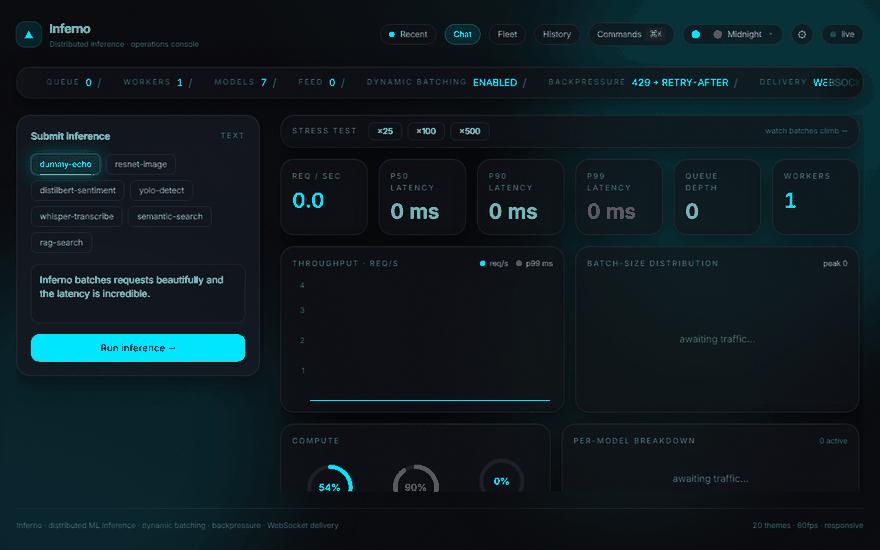

<sub>↑ live capture: submit → batched inference → stress test (throughput + batch
sizes climb) → command palette → theme switch → Fleet Command (autonomous
vehicles tracing real San-Francisco roads). Full-length recording:
[`docs/demo/inferno-demo.webm`](docs/demo/inferno-demo.webm).</sub>

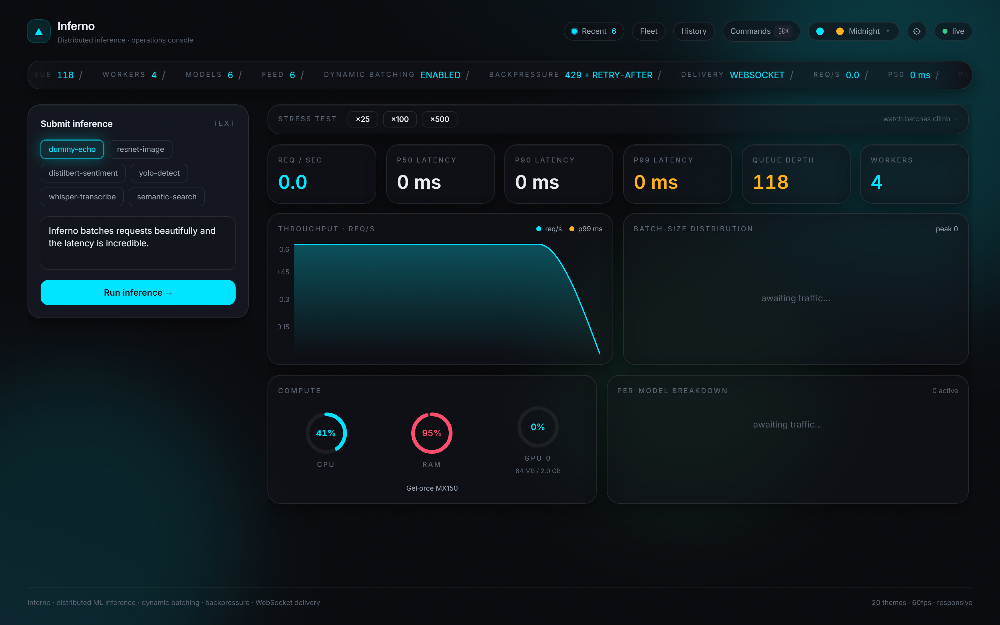

> Built backend-first around a centralized config + contracts spine, a decoupled
> broker abstraction, and a model-agnostic plugin interface — so nothing is
> hardcoded, nothing is duplicated, and every layer is swappable and testable.

## 📸 Gallery

| Object detection (YOLOv8 + bounding boxes) | Searchable / filterable history |
| --- | --- |
| 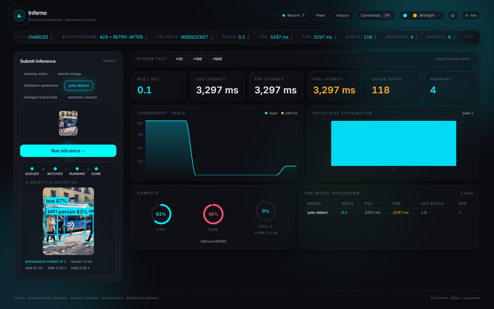 | 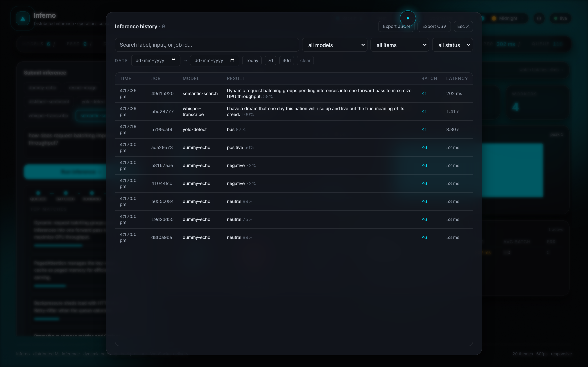 |
| **Speech-to-text (faster-whisper, audio → transcript)** | **RAG search (retrieve → rerank → cited passages)** |
| 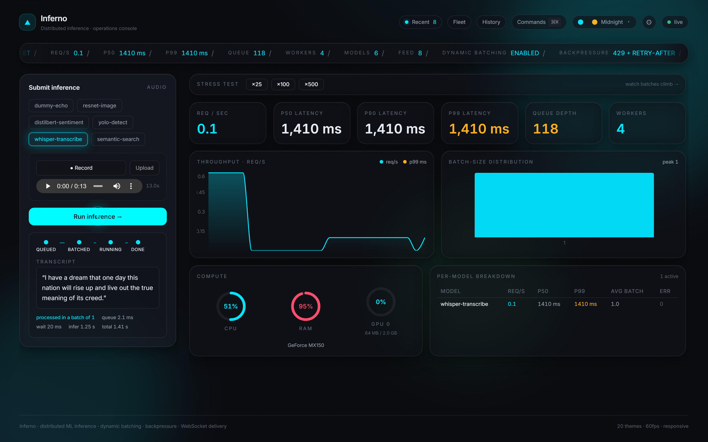 | 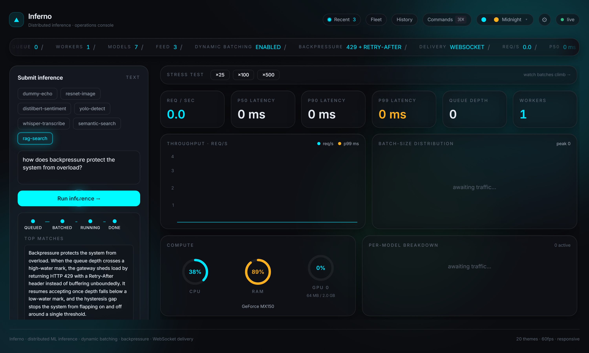 |
| **Command palette (⌘K)** | **Live activity feed** |
| 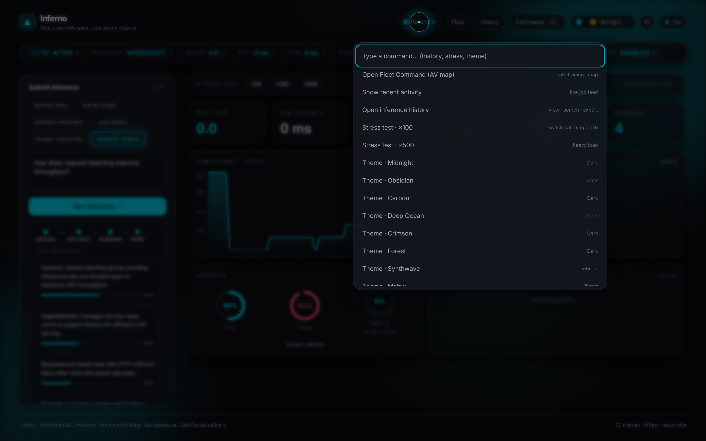 | 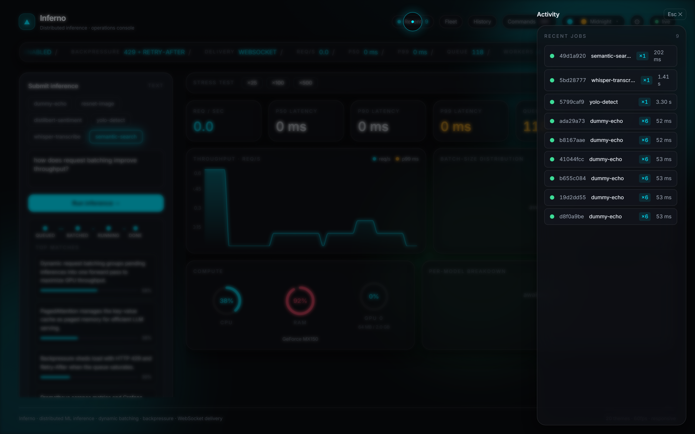 |

| **Streaming chat — local LLM, RAG-grounded, with citations** | **Fleet Command — AV map with real-road path tracing** |
| --- | --- |
| 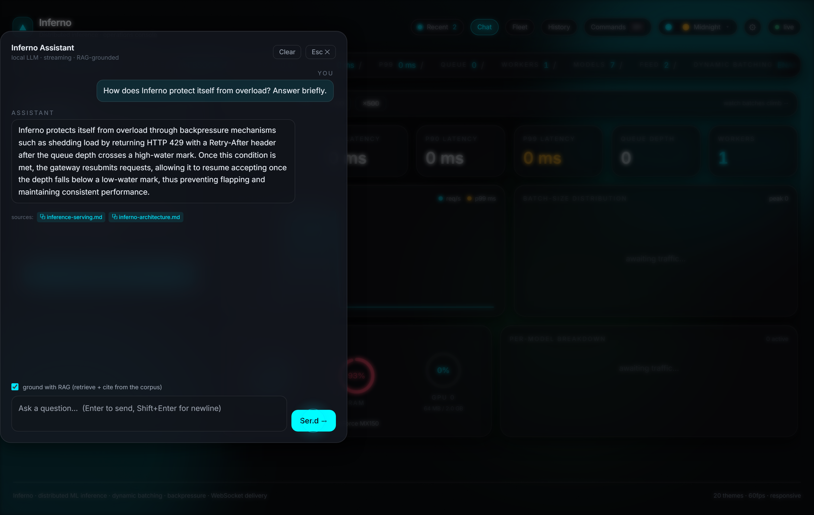 | 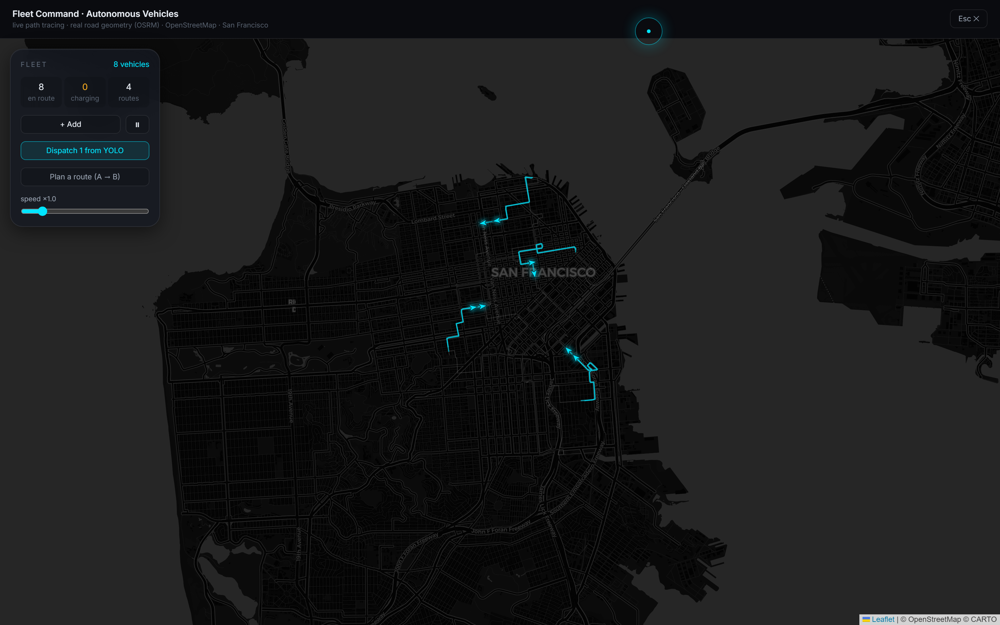 |

<sub>20 runtime themes — e.g. Synthwave: 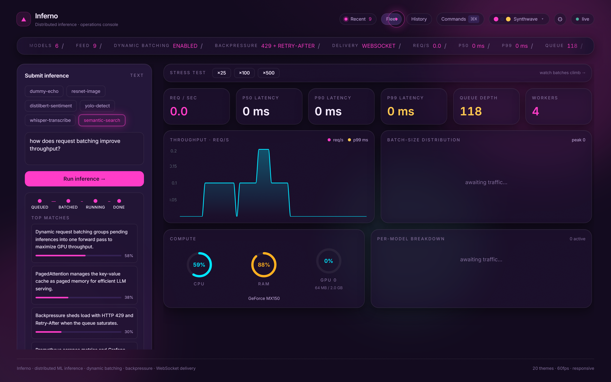</sub>

---

## Headline engineering features

| Feature | Where |
| --- | --- |
| **Dynamic request batching** (configurable max size + max wait window) | [`backend/worker/batcher.py`](backend/worker/batcher.py) |
| **Backpressure** — HTTP 429 + `Retry-After` with hysteresis | [`backend/gateway/backpressure.py`](backend/gateway/backpressure.py) |
| **Task-typed, model-agnostic plugins** (classification · detection · transcription) + config-driven registry | [`backend/models/`](backend/models/) |
| **5 reference models** — text sentiment, image classify, **object detection**, **speech-to-text**, dummy | [`backend/models/models.yaml`](backend/models/models.yaml) |
| **Optional API-key auth + per-client quotas** (Redis-backed, multi-replica safe) | [`backend/gateway/security.py`](backend/gateway/security.py) |
| **Result cache** (skip recompute on repeated inputs; ~12× faster on a hit) | [`backend/core/cache.py`](backend/core/cache.py) |
| **Perf toggles**: `torch.compile` + INT8/FP16 quantization, faster-whisper (CTranslate2) | [`backend/models/runtime.py`](backend/models/runtime.py) |
| **RAG retrieval** — chunked corpus, bi-encoder retrieve → cross-encoder rerank → **cited passages** | [`backend/models/rag.py`](backend/models/rag.py) |
| **Embeddings + semantic search** and **per-model live metrics** | [`backend/models/semantic_search.py`](backend/models/semantic_search.py) |
| **OpenTelemetry distributed tracing** (gateway → worker, optional/guarded) | [`backend/core/tracing.py`](backend/core/tracing.py) |
| **MCP server** — models exposed as agent tools (Claude Desktop becomes an agent) | [`backend/mcp_server/server.py`](backend/mcp_server/server.py) |
| **Streaming chat** — local LLM, **SSE token streaming**, answers **grounded in RAG** with citations | [`backend/chat/`](backend/chat/) |
| **Real-time result delivery** over a single-connection WS fan-out | [`backend/gateway/result_router.py`](backend/gateway/result_router.py) |
| **Full observability** — Prometheus `/metrics`, live metrics WS, structured JSON logs | [`backend/core/metrics.py`](backend/core/metrics.py) |
| **Graceful shutdown** — drain in-flight batch, zero job loss | [`backend/worker/lifecycle.py`](backend/worker/lifecycle.py) |
| **Fault isolation** — one bad input never crashes a worker | [`backend/worker/runner.py`](backend/worker/runner.py) |
| **CPU/GPU portability** — `device=auto`, guarded NVML telemetry | [`backend/models/runtime.py`](backend/models/runtime.py), [`backend/core/sysinfo.py`](backend/core/sysinfo.py) |

---

## Architecture

```
        ┌──────────────────────────────────────────────────────────┐
        │            Vite + React + TS console (Zustand)            │
        │     Submit jobs · live results · ops dashboard            │
        └───────────────┬───────────────────────┬──────────────────┘
                REST    │                       │  WebSocket (results + metrics)
        ┌───────────────▼───────────────────────▼──────────────────┐
        │                     FastAPI Gateway                       │
        │  POST /infer (validate · backpressure · enqueue · 429)    │
        │  WS /ws/{job_id} (single-conn result fan-out)             │
        │  WS /ws/metrics (~1 Hz cluster snapshot)                  │
        │  GET /health · /models · /metrics (Prometheus)            │
        │            >>> never runs a model <<<                     │
        └───────────────┬──────────────────────────────────────────┘
                        │  AsyncBroker interface (decoupled)
        ┌───────────────▼──────────────────────────────────────────┐
        │                  Redis (broker + bus)                     │
        │  Streams + consumer group  → one lane per model           │
        │  Pub/Sub channel per job   → results                      │
        │  Atomic counters + sample stream + heartbeats → metrics   │
        └───────────────┬──────────────────────────────────────────┘
                        │  WorkerBroker interface (sync)
        ┌───────────────▼──────────────────────────────────────────┐
        │              Worker Pool (N independent processes)        │
        │  read → DYNAMIC BATCH WINDOW → single forward pass        │
        │  publish per-job results · XACK · emit metrics            │
        │  CPU/GPU aware · graceful drain on SIGINT/SIGTERM         │
        └──────────────────────────────────────────────────────────┘
```

The gateway and workers **never import Redis directly** — they depend on the
`AsyncBroker` / `WorkerBroker` interfaces in [`backend/broker/base.py`](backend/broker/base.py).
The Redis Streams implementation lives behind them, so the transport is swappable.

---

## Quickstart (Windows — the primary workflow)

> Prereqs: [Miniconda](https://docs.conda.io/en/latest/miniconda.html) and
> [Node 20+](https://nodejs.org). No admin rights required.

```bat
:: 1. Install the Python stack into a conda env named "test" (Python 3.10).
::    Pick ONE:
scripts\install-gpu.bat      :: CUDA 12.4 build (NVIDIA GPU)
scripts\install-cpu.bat      :: CPU-only build

:: 2. Get a local Redis (portable, no install/admin). One-time:
powershell -ExecutionPolicy Bypass -File scripts\fetch-redis.ps1

:: 3. Launch everything in separate windows (Redis + gateway + 6 model
::    workers + chat service + frontend):
scripts\run-all.bat
```

Then open **http://localhost:5173**.

Prefer to run pieces individually?

```bat
scripts\run-redis.bat
scripts\run-backend.bat
scripts\run-worker.bat dummy-echo
scripts\run-worker.bat distilbert-sentiment
scripts\run-worker.bat resnet-image
scripts\run-worker.bat yolo-detect
scripts\run-worker.bat whisper-transcribe
scripts\run-worker.bat rag-search
scripts\run-chat.bat
scripts\run-frontend.bat
```

> **Record the demo yourself** (with whatever workers you have running):
> `scripts\make-demo.bat` drives a ~50s scripted tour with Playwright and
> writes `docs\demo\inferno-demo.gif` + `inferno-demo.webm`.

### Deploy a live demo

A recruiter-clickable demo (frontend + gateway + Redis + a light worker) is one
blueprint away — see **[DEPLOY.md](DEPLOY.md)** for Render / Fly.io / Vercel
steps. The heavy ML models need a paid box; keep those local. Configs live in
[`deploy/`](deploy/).

### Reproduce or copy the environment

Three ways to rebuild the exact Python env (conda `test`, Python 3.10, CUDA 12.4)
— full guide in **[ENVIRONMENT.md](ENVIRONMENT.md)**:

- **Recipe** — `conda env create -f environment.yml` (or `pip install -r requirements.lock.txt`)
- **Direct binary copy** — `scripts\pack-env.bat` → a `conda-pack` tarball; restore offline with `scripts\restore-env.bat`
- **App wheel** — `scripts\export-env.bat` builds `dist\inferno-0.1.0-py3-none-any.whl`

`environment.yml` carries PyTorch's `--extra-index-url` so the `+cu124` wheels
resolve on recreate. Regenerate every artifact with `scripts\export-env.bat`.

### Quickstart (conda, any OS)

```bash
conda create -n test python=3.10 -y && conda activate test
pip install -r requirements.txt
pip install -r requirements-ml-gpu.txt     # or requirements-ml-cpu.txt
# Redis: docker compose up redis   (or any local Redis / Memurai)
export PYTHONPATH=$PWD
uvicorn backend.gateway.app:app --port 8000          # gateway
INFERNO_WORKER__MODEL_NAME=dummy-echo python -m backend.worker.main   # a worker
cd frontend && npm install && npm run dev             # UI
```

### Quickstart (Docker)

```bash
docker compose up --build           # redis + gateway + 3 workers + frontend
docker compose up --scale worker-dummy=3   # scale a model's worker pool
```

---

## 💬 Streaming chat (local LLM + RAG)

A separate **chat service** ([`backend/chat/`](backend/chat/)) hosts a small local
instruct model and serves a single **SSE** endpoint that streams an answer
token-by-token. It first retrieves grounding passages from the platform's RAG
model (it's a decoupled HTTP/WS client of the gateway, like the MCP server), then
generates an answer **grounded in those passages with citations**. The gateway
stays thin — the LLM serving tier is its own process that scales independently
(the production pattern).

```bash
scripts\run-chat.bat        # serves on :8100; first request downloads the model (~1GB)
```

Open the **Chat** button (or ⌘K → "Open Assistant") in the UI, toggle *ground
with RAG*, and ask *"How does backpressure work?"* — tokens stream in live and the
answer cites the source documents. You chose a **local model** (no API key); set
`INFERNO_CHAT__MODEL_ID` to swap it.

## 🤖 Agent integration (MCP)

Inferno ships an **MCP (Model Context Protocol) server** that exposes every model
as an agent-callable tool — so an LLM client (Claude Desktop, an agent SDK, …)
becomes an **agent that orchestrates the platform** on its own: detect objects,
transcribe audio, classify text, run semantic search, and read live metrics.

Tools: `list_models`, `health`, `classify_text`, `detect_objects` (URL or base64),
`transcribe_audio` (URL or base64), `semantic_search`, `run_inference`,
`get_metrics`. The server is a thin, decoupled **client** of the gateway's public
REST + WebSocket API (it never imports the gateway), so it scales independently.

Wire it into Claude Desktop by copying the `inferno` block from
[`mcp.example.json`](mcp.example.json) into your `claude_desktop_config.json`
(fix the two paths), then restart Claude. With the gateway + workers running
(`scripts\run-all.bat`), ask Claude things like *"what objects are in this image
URL?"* or *"transcribe this audio and tell me the sentiment"* — it calls the
tools itself.

```bash
# manual smoke test (stdio MCP server -> running gateway)
python -m backend.mcp_server.server
```

## Configuration

**Everything** tunable lives in one typed place: [`backend/core/config.py`](backend/core/config.py)
(Pydantic Settings), documented field-by-field in [`.env.example`](.env.example).
No module reads `os.environ` directly; no tunable is hardcoded. Fixed protocol
constants (key names, channel templates, metric names) live in
[`backend/core/constants.py`](backend/core/constants.py); categorical values are
enums in [`backend/core/enums.py`](backend/core/enums.py).

Override any value via env, e.g.:

```bash
INFERNO_BATCHING__MAX_BATCH_SIZE=64
INFERNO_BATCHING__MAX_BATCH_WAIT_MS=15
INFERNO_QUEUE__HIGH_WATERMARK=8000
INFERNO_INFERENCE__DEVICE=auto      # auto | cpu | cuda
```

Adding a model is purely additive: implement `BaseModel`, decorate the class
with `@register_kind("...")`, and add an entry to
[`backend/models/models.yaml`](backend/models/models.yaml). No core code changes.

---

## Engineering decisions & tradeoffs

**Why a ~20 ms batch window?** The window is the throughput/latency lever. Too
short and batches never form (throughput collapses to per-request overhead); too
long and every request eats the full wait even under light load. ~20 ms is below
human-perceptible latency yet long enough that, under load, dozens of requests
coalesce into one forward pass. The first job of a window arrives via a *blocking*
read (an idle worker costs nothing); subsequent jobs are drained non-blocking
until either `MAX_BATCH_SIZE` or `MAX_BATCH_WAIT_MS` is hit. Both are env-tunable.

**Why Redis Streams + consumer groups over `LIST`/`BRPOP`?** Streams give
at-least-once delivery with *explicit acks* and a pending-entries list. If a
worker dies mid-batch, its un-acked entries stay claimable and another worker
reclaims them (`XPENDING` + `XCLAIM`) — zero job loss. A plain `LIST` pop deletes
the item immediately, so a crash between pop and result is silent data loss.

**One stream per model lane.** Each model gets `inferno:jobs:<model>`. A worker
reads only its model's stream, so every job in a batch window is already the same
model — no cross-model filtering, and a saturated model can't head-of-line-block
a healthy one.

**`XACK` + `XDEL` on success.** Acked entries are deleted, so `XLEN` is an
accurate live backlog gauge that backpressure can trust. Un-acked entries (dead
worker) remain and are reclaimable.

**Why 429 over buffering?** Unbounded queues turn a load spike into a latency
collapse and then an OOM. When a lane's depth exceeds the high-water mark the
gateway *sheds load* — HTTP 429 + `Retry-After` — and only resumes below the
low-water mark. The hysteresis gap stops the system flapping on/off around a
single threshold. Backpressure is per-model, so one hot model doesn't reject
traffic to others.

**Single-connection result fan-out.** Naively, each result WebSocket opens its
own Redis Pub/Sub subscription — connection use grows O(clients) and exhausts the
pool under load (we hit this at 120 concurrent clients). Instead the gateway holds
**one** pattern subscription (`inferno:result:*`) and dispatches each message to
the right in-process waiter. Redis connections stay O(1) regardless of client
count. ([`result_router.py`](backend/gateway/result_router.py))

**Late-join-safe results.** Pub/Sub is fire-and-forget: a result published before
the client subscribes would be lost. Each result is therefore *also* stored under
a TTL'd key; the result waiter checks that key before listening, so a client that
connects a beat late still gets its result.

**CPU/GPU portability.** `INFERNO_INFERENCE__DEVICE=auto` prefers CUDA when a
usable device is present and transparently falls back to CPU otherwise — the same
image runs on a GPU box or a laptop. GPU *telemetry* uses a guarded `pynvml`
import: on CPU-only hosts the GPU fields are simply absent and the UI adapts. (On
the dev machine here, an old driver means torch runs on CPU while NVML still
reports the GPU — both paths exercised at once.)

**Redis 5.x compatibility.** Reclaim uses `XPENDING` + `XCLAIM` rather than
`XAUTOCLAIM` (6.2+), so the platform runs on the portable Windows Redis 5 build as
well as Memurai / Redis 7 in production.

**Cluster-wide metrics.** Workers do the inference, so they own the truth: they
bump atomic counters and append compact samples to a capped Redis stream, and
report CPU/RAM/GPU in their heartbeats. The gateway aggregates these into the
~1 Hz dashboard snapshot *and* the Prometheus `/metrics` output, so the push (WS)
and pull (Prometheus) views never disagree.

---

## Observability

- **Prometheus**: `GET /metrics` — `inference_requests_total{model,status}`,
  `inference_errors_total{model}`, `inference_queue_depth`,
  `inference_workers_active`, live latency-percentile and throughput gauges.
- **Live metrics WS**: `GET /api/v1/ws/metrics` — req/s, p50/p90/p99, queue depth,
  active workers, recent batch sizes, CPU/RAM, and (when present) GPU util + VRAM.
- **Structured logs**: `structlog` JSON; every job logs `job_id`, `worker_id`,
  `model_name`, `batch_size`, and timings. No `print()`, no bare `except`.

---

## Testing & verification

```bash
pytest backend/tests            # 29 tests; integration auto-skips without Redis
pytest backend/tests -m "not ml"  # skip heavy torch paths (what CI's fast job runs)
ruff check backend              # lint (clean)
cd frontend && npm run build    # typecheck + production build
```

Verified end-to-end on this machine (Windows 10, conda `test` / Python 3.10):

- **Round trip**: submit → Redis stream → worker → batch window → model → result
  over WS, with full timing breakdown.
- **Dynamic batching under load**: 120 concurrent jobs → **max batch 31 / 32**,
  avg ~19, 99% batched, with live p50/p90/p99 on the dashboard.
- **Backpressure**: flooding a lane returns **HTTP 429 + `Retry-After`** past the
  high-water mark, releasing below the low mark.
- **Graceful drain**: a stop signal mid-stream drains the in-flight batch and acks
  it — the integration test asserts the stream is fully drained with **zero
  pending entries** (zero job loss).
- **Real models**: DistilBERT sentiment ("absolutely fantastic" → POSITIVE 0.9999),
  ResNet-18 ONNX image classification, and **YOLOv8 object detection** (bus photo →
  `bus 0.87` + 3× `person` with bounding boxes) — all batched.
- **Durable persistence**: every inference is saved to a Redis history stream **and**
  `artifacts/inferences.jsonl`; surfaced via `GET /history` and the searchable UI.
- **UI power-features**: 20 runtime themes, one-click stress test, command palette
  (⌘K), job-detail drawer, live activity feed, and a history view with date + item
  filters and CSV/JSON export.

### Load testing

```bash
locust -f loadtest/locustfile.py --host http://127.0.0.1:8000
# open http://localhost:8089, ramp users, watch batch sizes climb on the dashboard
```

---

## Repository layout

```
inferno/
├─ backend/
│  ├─ core/        config · constants · enums · errors · schemas · logging
│  │               · metrics · sysinfo · redis_keys · redis_client · timing
│  ├─ broker/      base.py (interfaces) · redis_broker.py (Streams impl)
│  ├─ models/      base.py (ABC) · registry.py · runtime.py · models.yaml
│  │               · dummy.py · distilbert.py · resnet_onnx.py
│  ├─ gateway/     app · routes · ws · backpressure · result_router · dependencies
│  ├─ worker/      main · batcher · runner · lifecycle
│  └─ tests/       percentiles · batcher · backpressure · models · runner
│                  · schemas · integration (round-trip + graceful drain)
├─ frontend/       Vite + React + TS + Tailwind + Framer Motion + Recharts + Zustand
├─ scripts/        install-*.bat · run-*.bat · fetch-redis.ps1 · loadgen · screenshot
├─ loadtest/       locustfile.py
├─ .github/workflows/ci.yml   lint · pytest · ML · frontend build · docker→GHCR
├─ requirements*.txt · pyproject.toml · .env.example
├─ docker-compose.yml · Dockerfile · Makefile
```

---

## What I'd do next

- **Autoscaling workers** off queue depth (KEDA on Redis stream length).
- **Model warm pools** + readiness gating so a cold model never serves a slow first batch.
- **A/B & canary model routing** by request header or weighted lane.
- **Auth** (API keys / OIDC) on submit + per-tenant quotas feeding backpressure.
- **Kubernetes** manifests + HPA; GHCR images already built by CI.
- **Priority lanes** (the `priority` field is plumbed through; today it's FIFO).
- **Tracing** (OpenTelemetry spans across gateway → broker → worker).

---

## License

MIT — see `LICENSE`.
